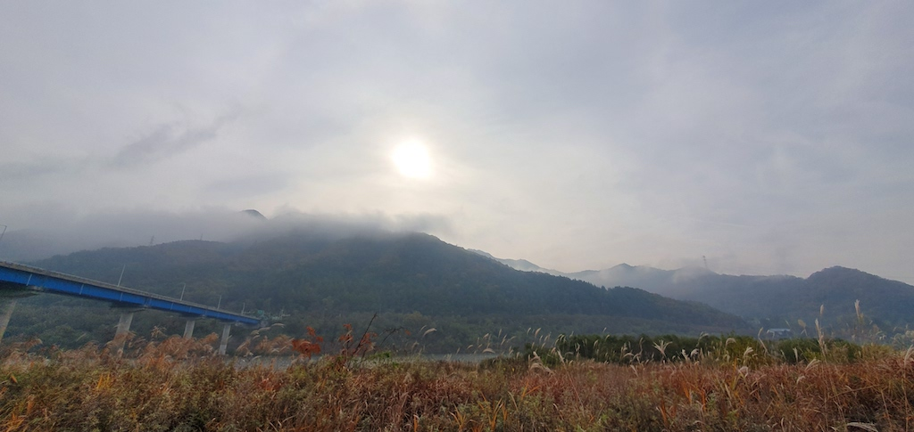
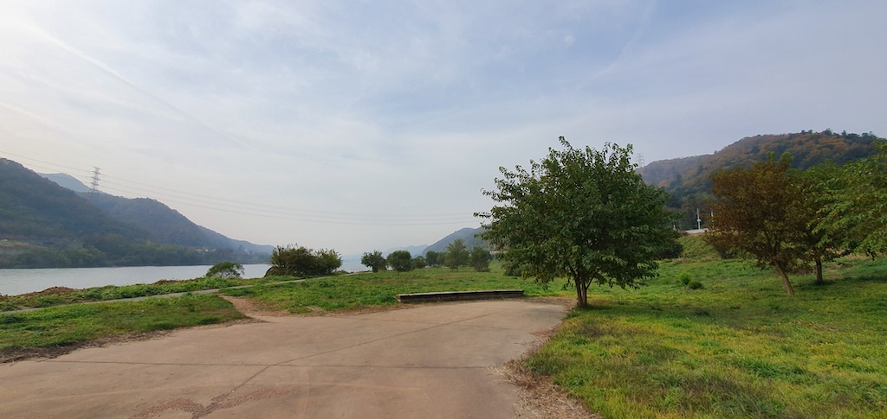
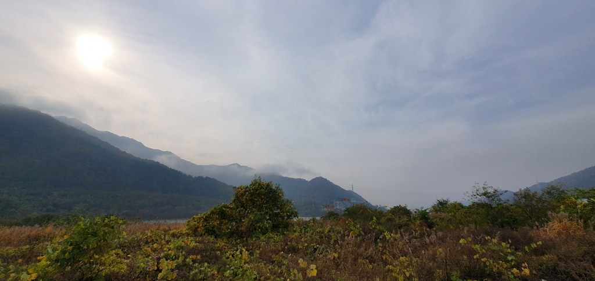

Hugo에 글을 쉽게 쓰는 법을 찾았다. 바로 메일앱을 사용하는 것이다. :) 생각이나 감정, 쓰고 싶은 생각을 메일로 적어 나에게 보내고 저녁에 취합해서 글로 올린다. 이렇게 적고 보니 비슷한 앱을 만들어도 좋을 것 같다.

오늘은 내 나무 친구를 소개하고 싶다. 이 친구를 만난 것은 여름이 끝나가고 가을이 다가올때 쯤이다. 수풀로 무성하던 들판을 정리하니 정말 멋진 나무가 있었다.

아침걷기를 하면 꼭 이 친구를 바라보고 온다. 매일 그 자리에 우뚝 서 있는 모습이 멋스럽다. 나무에게선 배울 점이 참 많다. 우뚝 서 있는 모습도 멋스럽고 바람에 흔들리는 모습도 멋스럽다. 나이가 들어가는 모습도 멋스럽다.

