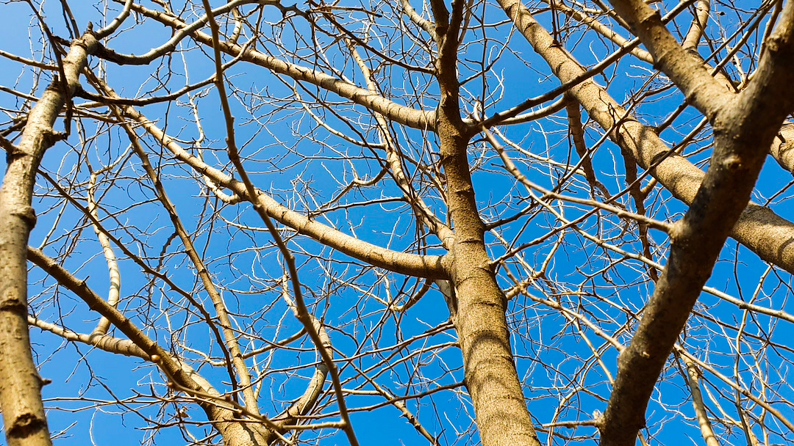

햇살이 따사롭다. 겨울이 지나가고 봄이 오는 듯 하다. 그 동안 내 삶은 힘든 삶이었다. 왜 힘든지 이유도 모른채 끌려다니는 듯한 삶을 살아 왔다. 

이제는 그 이유를 알 것 같다. 회사를 다닌 것 보다 내 회사를 만들고 싶다는 목표. 진정 원하는 목표를 위해 살지 못하니 살아감이 사는 것이 아니었다.

올해는 그 목표를 시작하려고 한다. 3월부터 홀로서기를 하게 되었다. 성공을 꿈꾸지는 않는다. 다만 오래 지속되는 회사를 만들고 싶다. 

훗날 죽음을 생각하니, 내 일을 시작하지 않은 것을 가장 후회할 것 같았다. 회사를 다녀도 내 일을 해도 내 마음은 이 사진처럼 고민과 선택의 연속일 것이다.

그러니 이제는 내 길을 가기 위한 여정을 시작해 보려고 한다. 얼마나 다양한 길을 걷게 될지 궁금하다. :)

